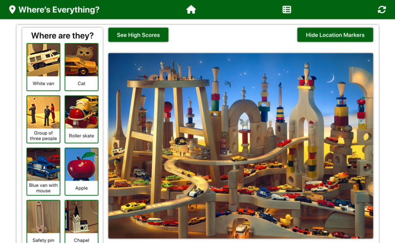

# Where's Everyting? Server

## Introduction

This project is the back-end for a "Where's Waldo?" game application. It is built using the Ruby on Rails framework.

The "Where's Waldo?" project primarily demonstrates integration of a front-end interface with a back-end API.

## Front End

The front-end repository can be found [here](https://github.com/xsherryhe/wheres-waldo).

## Preview

Run this project [here](https://xsherryhe.github.io/wheres-waldo/).

## Image Credits

1) WallpaperCave  
  https://wallpapercave.com/w/wp10091685  
  https://wallpapercave.com/w/wp7827096  
  https://wallpapercave.com/w/wp10091679  
  https://wallpapercave.com/w/wp10091687
